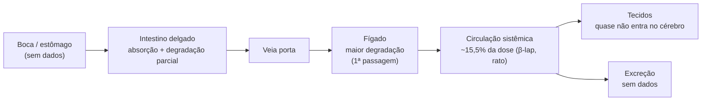

# Ipê-roxo (pau d'arco)

> A entrecasca tem uso tradicional amplo e boa base pré-clínica (anti-inflamatória, antimicrobiana, cicatrizante). Em humanos, a evidência é pequena e nenhum derivado mostrou benefício contra câncer. **Principal alerta:** o [[lapachol]] tem efeito anti-vitamina K (sangramento), é tóxico ao feto em animais e causa anemia em cães e macacos com doses repetidas.

## 1. Identificação
| Campo | Valor |
|---|---|
| Nome(s) comum(ns) | ipê-roxo, pau d'arco, lapacho, taheebo, piúva, ipê-rosa |
| Nome científico | *Handroanthus impetiginosus* (Mart. ex DC.) Mattos |
| Sinônimos botânicos | *Tabebuia impetiginosa* (Mart. ex DC.) Standl.; *Tabebuia avellanedae* Lorentz ex Griseb. |
| Família | Bignoniaceae |
| Parte usada | Entrecasca (casca interna) do tronco |

## 2. Características da planta
- Árvore decídua de 8–30 m, tronco de 60–100 cm de diâmetro, madeira muito dura.
- Folhas compostas com 5–7 folíolos. Flores roxo-rosadas em panículas, com tubo amarelo, que surgem com a árvore sem folhas no inverno seco.
- Fruto em cápsula longa (11–38 cm) com sementes aladas.
- Ocorre na Amazônia, Cerrado, Mata Atlântica, Pantanal e Caatinga.
- Status de conservação: *Near Threatened* (IUCN), por pressão da extração de madeira.
- **Confusão comum:** "pau d'arco" é vendido a partir de várias espécies de *Handroanthus*/*Tabebuia*, com composição diferente.

## 3. Princípios ativos e compostos químicos
| Composto | Classe química | Nota | Observação |
|---|---|---|---|
| Lapachol | 1,4-naftoquinona | [[lapachol]] | Marcador principal; efeito anti-vitamina K |
| β-lapachona | orto-naftoquinona | [[beta-lapachona]] | Alvo de ensaios oncológicos (ARQ 501/761) |
| α-lapachona, furanonaftoquinonas, tabebuína, menaquinona | naftoquinonas | — | A napabucasina é uma furanonaftoquinona presente na planta |
| Quercetina, rutina | flavonoides | — | Antioxidantes |
| Avelanedaesídeos | iridoides | — | 19 glicosídeos catalogados na casca (iridoides, lignanas, isocumarinas, feniletanoides, fenólicos) |
| Antraquinonas, derivados do ácido benzoico, dialdeídos de ciclopenteno, tecomina (alcaloide) | vários | — | — |

- Lapachol e β-lapachona se degradam com a luz.
- Numa análise de 12 produtos comerciais, só 1 tinha lapachol, e em traços.

## 4. Ações fisiológicas (farmacodinâmica)
| Ação | Mecanismo proposto | Evidência |
|---|---|---|
| Anticoagulante | Lapachol inibe as redutases da vitamina K (como a varfarina) → prolonga o tempo de protrombina | Humano (fase I do NCI) e cão |
| Anti-inflamatória | Redução de PGE2, COX-2, TNF-α e IL-1β | In vitro e animais |
| Citotóxica | β-lapachona é ativada pela NQO1 → ciclo redox e morte da célula tumoral | In vitro, animais e fase 1 humana (efeito modesto) |
| Antimicrobiana | Naftoquinonas (inclusive contra MRSA) | In vitro |
| Cicatrizante | — | Bovinos (tópico) e ratos |

## 5. Absorção e percurso no organismo (ADME)
> Não existe estudo farmacocinético do **chá ou extrato** da casca. Os dados abaixo são dos **compostos isolados em ratos**.

### Onde começa e onde absorve
- **Boca e estômago:** sem dados de absorção relevante.
- **Intestino delgado:** provável sítio principal *(inferência)*, porque são moléculas pequenas e lipofílicas. O intestino também degrada a β-lapachona (efeito de primeira passagem).
- **Absorção lenta:** Tmax oral de 6 h e t½ oral (11,4 h) bem maior que a IV (2,45 h) sugerem que a absorção lenta controla a curva — cinética "flip-flop" *(interpretação)*.
- **Biodisponibilidade oral da β-lapachona:** 15,5% em ratos.
- **Chá × álcool:** lapachol e β-lapachona são pouco solúveis em água. O chá extrai pouco desses compostos, e a infusão foi inativa em células tumorais até 400 µg/mL.

### Percurso fisiológico (via oral)

### Distribuição
- Lapachol IV em ratos: a exposição cerebral foi só **0,028%** da plasmática (AUC cérebro/plasma), ou seja, quase não atravessa a barreira hematoencefálica.

### Metabolismo
- β-lapachona degradada em homogenatos de órgãos na ordem fígado > intestino delgado ≥ intestino grosso. Estável no plasma (99% intacta em 24 h).
- Via proposta pelos autores, não confirmada: redução pela NQO1 seguida de glicuronidação.

### Excreção
- Sem dados → pendência.

### Meia-vida
| Composto | Espécie | Via | Dose | t½ | Fonte |
|---|---|---|---|---|---|
| β-lapachona | Rato | IV | 1,5 mg/kg | 2,45 h | Kim et al. 2015 |
| β-lapachona | Rato | Oral | 40 mg/kg | 11,36 h (Tmax 6 h; Cmax 0,218 µg/mL; F = 15,5%) | Kim et al. 2015 |
| Lapachol | Rato | IV | 6,8 mg/kg | 2,42 h | Chen et al. 2020 |
| Lapachol | Humano | Oral | fase I do NCI | Concentração eficaz não atingida sem toxicidade | Block et al. 1974 |

## 6. Dose de ação
### Humano
- **Tintura oficial** (Formulário de Fitoterápicos da Farmacopeia Brasileira): entrecasca 20 g em álcool 70% q.s.p. 100 mL. Tomar 2,5–5 mL diluídos em 50 mL de água, 1–3 vezes ao dia (≈0,5–3 g de droga vegetal/dia). Indicação: auxiliar em afecções inflamatórias de pele e mucosas. Uso adulto.
- **Duração** (RENISUS/MS): no máximo 30 dias contínuos, com pausa de 7 dias antes de repetir.
- **Estudo clínico:** cápsulas de 1.050 mg/dia por 8 semanas (dismenorreia; 12 mulheres).

### Veterinário
- **Bovinos, tópico:** decocção da casca com carboximetilcelulose, aplicada por 17 dias em feridas (Lipinski et al. 2012). A concentração exata da decocção não está no resumo → pendência.
- **Oral em qualquer espécie:** **sem dose validada.**

## 7. Toxicidade e DL50
| Composto/extrato | Espécie | Via | DL50 ou achado | Fonte |
|---|---|---|---|---|
| Lapachol | Camundongo BALB/c | Oral | **DL50 621 mg/kg** (machos 487; fêmeas 792) | Morrison et al. 1970 |
| Lapachol | Rato | Oral | **DL50 > 2,4 g/kg** | Morrison et al. 1970 |
| Lapachol | Cão (beagle) | Oral, 24 doses (0,25–2 g/kg/dia) | Sem mortes; anemia, TP prolongado, fosfatase alcalina ↑ | Morrison et al. 1970 |
| Lapachol | Macaco cinomolgo | Oral, repetida | Letal: 0,5 g/kg/dia (após 6 doses) e 1 g/kg/dia (após 5) | Morrison et al. 1970 |
| Lapachol | Rato | Oral, 100 mg/kg | Morte fetal; ↓ peso da vesícula seminal | MSKCC; Wikipedia (*H. impetiginosus*) — fonte secundária |
| Extrato aquoso da casca | Camundongo | Oral | Sem óbitos até 5 g/kg (sinais leves) | Fitoterapia Brasil (ref. 18) |
| β-lapachona (ARQ 761) | Humano | IV | MTD 390 mg/m²; anemia 79%, hemólise 17%, hipóxia grau 3 por metemoglobinemia em 26% | Gerber et al. 2018 |

**Sinais de intoxicação:** anemia (palidez de mucosas, reticulocitose), sangramentos, náusea e vômito, bilirrubinúria, proteinúria.

## 8. Benefícios e indicações
| Indicação | Espécie | Nível de evidência | Fonte |
|---|---|---|---|
| Afecções inflamatórias de pele e mucosas (tintura) | Humano | Tradicional + pré-clínica (uso oficial no Brasil) | FFFB |
| Cicatrização de feridas (tópico) | **Bovino** | Clínica-preliminar (11 novilhas) | Lipinski et al. 2012 |
| Dor na dismenorreia | Humano | Clínica-preliminar (n=12, aberto, sem controle) | McClure et al. 2022 |
| Mucosite oral na radioterapia | Humano | Clínica-preliminar (40 pacientes, sem controle) | Giacomelli et al. 2015 |
| Anti-inflamatória, gastroprotetora, antimicrobiana | Roedores / in vitro | Pré-clínica | Várias |
| Câncer | Humano | **Sem benefício** (lapachol, ARQ 761, napabucasina em fase 3) | Block 1974; Gerber 2018; CanStem |

## 9. Atenção
- **Contraindicações** (Brasil): menores de 12 anos, gestantes, lactantes, hemofílicos; alcoolistas (tintura). O Formulário acrescenta diabéticos, cardiopatas, nefropatas, hepatopatas e doentes crônicos.
- **Interações:** anticoagulantes (varfarina, heparina), antiagregantes, AINEs, corticoides, vitaminas E e K; pode reduzir o efeito de imunossupressores. Suspender cerca de 2 semanas antes de cirurgia.
- **Gestação:** fetotóxico e clastogênico em roedores.
- **Espécies sensíveis:**
  - **Cão:** anemia e TP prolongado com lapachol em doses repetidas.
  - **Gato:** sem estudo. Cautela *(inferência)*, pela sensibilidade da espécie a agentes oxidantes e pela glicuronidação deficiente.
- **Carência (animais de produção):** **não existe.** Uso oral em bovino de corte ou leite gera risco de resíduo não avaliado.
- **Qualidade:** a composição varia muito entre produtos. Prefira matéria-prima com laudo e identificação botânica.

## 10. Homeopatia
- **Não encontrada** preparação homeopática dinamizada de *Handroanthus/Tabebuia* nas fontes consultadas.
- Existe **"tintura-mãe" de lapacho** vendida como suplemento. É extrato alcoólico concentrado, sem diluição, com o mesmo risco do extrato.
- Consultado em 2026-09: busca web (PT/EN/DE).

## 11. Estudos
| Estudo | Tipo | Espécie | n | Resultado | Link |
|---|---|---|---|---|---|
| Lipinski et al. 2012 | Experimental, feridas por punch 2 cm | Bovino (novilhas Purunã) | 11 | Decocção tópica de ipê-roxo melhorou a cicatrização por 2ª intenção | [PubMed 23983390](https://pubmed.ncbi.nlm.nih.gov/23983390/) |
| Morrison et al. 1970 | Toxicologia oral | Camundongo, rato, cão, macaco | — | DL50 e anemia (ver seção 7) | [Toxicol Appl Pharmacol 17:1-11](https://www.sciencedirect.com/science/article/abs/pii/0041008X70901262) |
| Kim et al. 2015 | Farmacocinética | Rato | — | β-lapachona: F = 15,5%; 1ª passagem fígado > intestino | [PMC4428724](https://pmc.ncbi.nlm.nih.gov/articles/PMC4428724/) |
| Chen et al. 2020 | Farmacocinética IV | Rato | 6 | Lapachol t½ 2,4 h; quase não chega ao cérebro | [PMC9056296](https://pmc.ncbi.nlm.nih.gov/articles/PMC9056296/) |
| McClure et al. 2022 | Braço único, aberto | Humano | 12 | Dor ↓ (p<0,01); 75% com eventos adversos leves; 5/12 com alteração laboratorial | [PMC10032363](https://pmc.ncbi.nlm.nih.gov/articles/PMC10032363/) |
| Gerber et al. 2018 | Fase 1 (ARQ 761) | Humano | 42 | Atividade modesta; anemia e hemólise | [PMC6203852](https://pmc.ncbi.nlm.nih.gov/articles/PMC6203852/) |
| Giacomelli et al. 2015 | Série de casos | Humano | 40 | "Fácil, seguro e factível" para mucosite | [PubMed 26451712](https://pubmed.ncbi.nlm.nih.gov/26451712/) |
| Pires et al. 2015 | In vitro | Linhagens tumorais | — | Extrato metanólico IC50 77–111 µg/mL; infusão inativa até 400 µg/mL | [PMC6331982](https://pmc.ncbi.nlm.nih.gov/articles/PMC6331982/) |
| CanStem111P / 303C | Fase 3 (napabucasina) | Humano | >1.100 cada | Sem ganho de sobrevida (pâncreas e colorretal) | [PMC10036520](https://pmc.ncbi.nlm.nih.gov/articles/PMC10036520/) · [PubMed 36503738](https://pubmed.ncbi.nlm.nih.gov/36503738/) |

## 12. Status regulatório
- **Brasil:**
  - Tintura da entrecasca no Formulário de Fitoterápicos da Farmacopeia Brasileira (1º Suplemento 2018; 2ª ed., RDC 463/2021).
  - Monografia na RENISUS.
  - Produto registrado hoje na Anvisa: **não confirmado**.
  - MAPA (uso veterinário): **não verificado**.
- **EUA:** suplemento alimentar (DSHEA); status GRAS não confirmado.
- **Europa:** sem monografia da EMA/HMPC localizada.

## 13. Pendências (a verificar)
- [ ] Consultar o banco de produtos da Anvisa e do MAPA
- [ ] Concentração da decocção usada em bovinos (texto integral de Lipinski 2012)
- [ ] Dados de excreção do lapachol e da β-lapachona
- [ ] Farmacocinética em ruminantes (efeito do rúmen): nenhum dado encontrado
- [ ] Verificar se há matéria médica homeopática com *Tabebuia*

## Referências
1. Morrison RK et al. Oral toxicology studies with lapachol. *Toxicol Appl Pharmacol* 1970;17:1-11. https://www.sciencedirect.com/science/article/abs/pii/0041008X70901262
2. Kim et al. Preclinical pharmacokinetic evaluation of β-lapachone. *Biomol Ther* 2015;23(3):296-300. https://pmc.ncbi.nlm.nih.gov/articles/PMC4428724/
3. Chen et al. Long-circulating lapachol nanoparticles… *RSC Adv* 2020. https://pmc.ncbi.nlm.nih.gov/articles/PMC9056296/
4. Lipinski LC et al. Effects of 3 topical plant extracts on wound healing in beef cattle. *Afr J Tradit Complement Altern Med* 2012. https://pubmed.ncbi.nlm.nih.gov/23983390/
5. McClure et al. Safety and tolerability of Pau d'Arco for primary dysmenorrhea. *Adv Integr Med* 2022. https://pmc.ncbi.nlm.nih.gov/articles/PMC10032363/
6. Gerber DE et al. Phase 1 study of ARQ 761. *Br J Cancer* 2018;119:928-936. https://pmc.ncbi.nlm.nih.gov/articles/PMC6203852/
7. Block JB et al. Early clinical studies with lapachol (NSC-11905). *Cancer Chemother Rep Part 2* 1974;4(4):27-28.
8. Pires et al. Bioactive properties of *Tabebuia impetiginosa*-based phytopreparations. *Molecules* 2015. https://pmc.ncbi.nlm.nih.gov/articles/PMC6331982/
9. Anvisa. Formulário de Fitoterápicos da Farmacopeia Brasileira, 1º Suplemento, 2018. https://www.abrafidef.org.br/arqSite/2018_Suplemento_FFFB.pdf
10. Fitoterapia Brasil — *Handroanthus impetiginosus* (inclui RENISUS). https://fitoterapiabrasil.com.br/planta-medicinal/handroanthus-impetiginosus
11. MSKCC — Pau d'arco. https://www.mskcc.org/cancer-care/integrative-medicine/herbs/pau-d-arco
12. Dossiê verificado completo (PDF): ![[ipe-roxo-dossie-verificado-2026-09.pdf]]

---
Voltar: [[00-materia-medica-home|Matéria Médica]]
