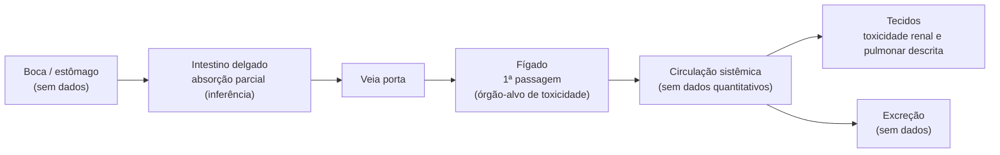

# Pinhão-roxo (pião-roxo)

> Arbusto tóxico da caatinga/cerrado, da mesma família da mamona. Tem uso tradicional amplo (dor de dente, anti-inflamatório, anti-hipertensivo) e boa base pré-clínica (anticoagulante, antioxidante, anti-veneno de jararaca), mas **nenhum ensaio clínico humano**. **Principal alerta:** o látex é cáustico para pele e mucosas, há toxicidade sistêmica documentada (digestiva, renal, cardiovascular, neurológica) e o extrato das partes aéreas foi **letal em ratos em doses próximas das supostamente terapêuticas**. Estar na RENISUS ≠ ser seguro para automedicação.

## 1. Identificação
| Campo | Valor |
|---|---|
| Nome(s) comum(ns) | pinhão-roxo, pião-roxo, peão-roxo, mamoninha, *bellyache bush* |
| Nome científico | *Jatropha gossypiifolia* L. |
| Sinônimos botânicos | *Jatropha gossypifolia* L. (grafia antiga); *Adenoropium gossypiifolium* (L.) Pohl |
| Família | Euphorbiaceae |
| Parte usada | Folhas, caule, raiz, semente e látex no uso popular; a **folha** é a parte com mais estudos |

## 2. Características da planta
- Arbusto ou arvoreta lenhosa de até ~2,5 m, aspecto ornamental.
- **Brotações e folhas jovens intensamente vinho/púrpura** (daí "pião-roxo"), passando a verde com a idade.
- Folhas alternas, grandes, palmado-lobadas (3–5 lobos agudos), pilosas, com estruturas glandulares.
- Flores pequenas, vermelho-arroxeadas, reunidas no ápice dos ramos.
- **Fruto em cápsula verde, pequena (~1 cm), nitidamente trilobada (tricarpelar)** — bastante diagnóstico.
- Nativa da América tropical (México à América do Sul); registrada em todas as grandes regiões do Brasil (Kew/POWO).
- **Confusões comuns:** outras *Jatropha* próximas, sobretudo *J. curcas* (pinhão-manso, folhas verdes não arroxeadas) e *J. multifida*. A coloração arroxeada das brotações é a melhor pista de campo. A confirmação definitiva exige exsicata/chave taxonômica.

## 3. Princípios ativos e compostos químicos
| Composto | Classe química | Nota do composto | Observação |
|---|---|---|---|
| Jatrofona | diterpeno macrocíclico | — | Diterpeno-marcador do gênero; atividade citotóxica/antitumoral *in vitro* |
| Jatropholonas A e B, jatrofatriona | diterpenos | — | Isolados de raiz/caule |
| Gadaína, gossipifan, gossipidieno, prasantalina | lignanas | — | Associadas à atividade sobre coagulação e à ação anti-veneno |
| Ciclogossina A e B | peptídeos cíclicos | — | Peptídeos característicos da espécie |
| Apigenina, vitexina, isovitexina, luteolina, orientina, isoorientina, quercetina, canferol, crisina | flavonoides | — | Antioxidantes; luteolina/apigenina com ação anti-inflamatória |
| Ácidos gálico, clorogênico, cafeico, vanílico, *p*-cumárico, ferúlico, *trans*-cinâmico | ácidos fenólicos | — | Ácido ferúlico tem atividade analgésica/anti-inflamatória descrita |
| α-amirina, β-amirina, lupeol | triterpenos | — | Amirinas e lupeol são antinociceptivos/anti-inflamatórios em modelos animais |
| Taninos, alcaloides, esteroides, saponinas | vários | — | Relatados em triagens fitoquímicas |
| **Curcina** | lectina/toxalbumina | — | **Presente na semente; toxina do tipo inativadora de ribossomo (análoga à ricina da mamona)** |

- A composição varia muito conforme a parte da planta (folha, raiz, caule, látex) e o solvente de extração.
- O látex contém compostos cáusticos e inflamatórios (ver seções 7 e 9).

## 4. Ações fisiológicas (farmacodinâmica)
| Ação | Mecanismo proposto | Evidência |
|---|---|---|
| Anticoagulante | Extrato aquoso da folha prolonga o **TTPa** (via intrínseca/comum), sem alterar o TP (via extrínseca) | *In vitro* (plasma humano) — Félix-Silva et al. 2014 |
| Antioxidante | Sequestro de radicais (hidroxil, peroxil, superóxido), quelação de metais, poder redutor | *In vitro* |
| Anti-veneno botrópico | Extrato aquoso da folha inibe ações enzimáticas e locais do veneno de *Bothrops jararaca* (hemorragia, edema, coagulação) | *In vitro* e camundongos — Félix-Silva et al. 2014 |
| Hipotensora / vasorrelaxante | Redução de pressão arterial e relaxamento vascular | Ratos |
| Anti-inflamatória (edema de pata por carragenina) | Extrato aquoso por infusão (10% p/v) das folhas, **oral 50/100/200 mg/kg**: ~55% de inibição a 100 mg/kg e ~51% a 200 mg/kg, comparável à indometacina; **tópico em lipogel 5% p/p**: ~54% de inibição, superior à indometacina e ao diclofenaco tópicos | Rato Wistar — estudo de atividade anti-inflamatória/anti-artrite |
| Antinociceptiva | Atribuída a amirinas, lupeol e ácido ferúlico | Pré-clínica (animais) |
| Antimicrobiana | Extratos e frações, inclusive contra patógenos orais (bochecho experimental) | *In vitro* — Idowu et al. 2021 |
| Citotóxica / antitumoral | Jatrofona (ciclo redox / alquilação) | *In vitro* |

> O uso tradicional para **dor de dente** tem plausibilidade (presença de compostos anti-inflamatórios/analgésicos), mas o alívio relatado também pode vir da **irritação/cauterização química do látex sobre a mucosa** *(inferência fisiopatológica)*, não de analgesia benigna comprovada.

## 5. Absorção e percurso no organismo (farmacocinética — ADME)
> **Não foi localizado nenhum estudo de ADME/farmacocinética** para *J. gossypiifolia* nem para seus compostos isolados (jatrofona etc.). Todo o conteúdo abaixo é inferência a partir da química das moléculas e deve ser tratado como pendência.

### Onde começa e onde absorve
- **Via oral:** sem dados de absorção. Compostos fenólicos e flavonoides glicosilados (vitexina etc.) tendem a ter absorção oral limitada *(inferência)*; aglico­nas lipofílicas (apigenina, triterpenos) tendem a absorver melhor no intestino delgado *(inferência)*.
- **Látex/tópico em mucosa:** a ação relevante é **local e cáustica**, não uma absorção sistêmica controlada.

### Percurso fisiológico (via oral, inferido)

### Distribuição
- Sem dados. A toxicidade crônica atingiu fígado, rim e pulmão (ver seção 7), sugerindo exposição sistêmica desses órgãos *(interpretação)*.

### Metabolismo
- Sem dados. Fígado como provável sítio principal e órgão-alvo de dano *(inferência)*.

### Excreção
- Sem dados → pendência.

### Meia-vida
| Composto | Espécie | Via | Dose | t½ | Fonte |
|---|---|---|---|---|---|
| — | — | — | — | **sem dados** | nenhum estudo localizado |

## 6. Dose de ação
### Humano
- **Sem posologia oficial.** Não há monografia no Formulário de Fitoterápicos da Farmacopeia Brasileira para a espécie e nenhum fitoterápico registrado na Anvisa.
- Uso popular (dor de dente, anti-hipertensivo, anti-inflamatório) **sem dose padronizada e sem validação clínica**.

### Veterinário (por espécie)
- **Sem dose validada em nenhuma espécie.** Há relatos etnoveterinários (a revisão de Félix-Silva 2014 reúne usos humanos e veterinários), mas sem posologia estabelecida.
- **Bovinos (ruminantes):** a via oral passa pelo rúmen antes da absorção — nenhum dado de monogástrico se transfere, e não há estudo em ruminantes → pendência.

## 7. Toxicidade e DL50
| Composto/extrato | Espécie | Via | DL50 ou achado | Fonte |
|---|---|---|---|---|
| Extrato etanólico das partes aéreas | Rato Wistar | Oral, 13 semanas (45/135/405 mg/kg/dia) | **Letalidade: 46,6% machos e 13,3% fêmeas a 405 mg/kg; 13,3% a 135 mg/kg; sem óbitos a 45 mg/kg** | Oliveira/Souza et al., *Rev Bras Farmacogn* |
| Extrato etanólico das partes aéreas | Rato Wistar | Oral, crônica | Necrose e esteatose hepática, fibrose lobular zona 3; necrose renal focal; **pneumonite intersticial crônica**; anemia macrocítica hipercrômica (machos, 405 mg/kg) | idem |
| Látex | Humano (relatos) | Tópico/mucosa | **Cáustico e inflamatório** para pele e mucosas | Félix-Silva et al. 2014 |
| Planta (ingestão) | Humano/animal (relatos) | Oral | Distúrbios gastrointestinais, dor intensa, desidratação, comprometimento renal, alterações cardiovasculares e, em casos graves, manifestações neurológicas | Félix-Silva et al. 2014 |
| Curcina (semente) | — | — | Lectina inativadora de ribossomo, análoga à ricina (toxicidade por ingestão de sementes) | revisões do gênero |
| Extrato metanólico | Rato Wistar | Oral (dose não detalhada no resumo) | **Toxicidade reprodutiva:** redução dose-dependente de motilidade e concentração espermática, aumento de anormalidades morfológicas (cabeça/cauda) | Ubah et al. 2016 *(resumo/TLDR; buscar texto integral — pendência)* |
| DL50 de dose única | — | — | **sem dados confiáveis para a espécie** | — |

**Sinais de intoxicação:** irritação/queimadura de mucosa pelo látex; vômito, dor abdominal e diarreia; desidratação; sinais renais; alterações cardiovasculares; em casos graves, sinais neurológicos.

> Os autores da revisão toxicológica brasileira concluíram que, pelo conjunto de evidências, o uso popular deveria ser **desaconselhado pela relação risco/benefício desfavorável**.

## 8. Benefícios e indicações
| Indicação | Espécie | Nível de evidência | Fonte |
|---|---|---|---|
| Dor de dente / analgesia | Humano | **Tradicional** (documentado na revisão; sem validação clínica) | Félix-Silva et al. 2014 |
| Anti-inflamatório, anti-hipertensivo, antimicrobiano | Humano | Tradicional + pré-clínica | Félix-Silva et al. 2014 |
| Anticoagulante / antitrombótico | Humano (plasma) | Pré-clínica (*in vitro*) | Félix-Silva et al. 2014 |
| Antídoto local contra veneno de *Bothrops* | Camundongo | Pré-clínica | Félix-Silva et al. 2014 |
| Hipotensor / vasorrelaxante | Rato | Pré-clínica | revisões |
| Anti-inflamatória (oral e tópica, carragenina) | Rato Wistar | Pré-clínica (ver doses na seção 4) | Estudo anti-inflamatório/anti-artrite, *Int J Pharm Pharm Sci* |
| Analgésica, neurofarmacológica e antidiarreica | Camundongo | Pré-clínica | Apu et al. 2012 |
| Antimicrobiana contra patógenos orais (apoio ao uso em dor de dente) | *In vitro* | Pré-clínica | Idowu et al. 2021 |
| Anticoagulante em sangue (uso laboratorial) | Não especificado no resumo | Pré-clínica (*in vitro*; efeito máximo a 0,1 mL de extrato por mL de sangue) | Oduola et al. 2005 |
| Hepatoprotetor contra lesão por paracetamol | Camundongo | Pré-clínica (**contrasta com a hepatotoxicidade crônica da seção 7** — efeito depende de dose/duração) | Temdie et al. 2023 |
| Tratamento odontológico validado | Humano | **Sem demonstração clínica** | Félix-Silva et al. 2014 |

## 9. Atenção
- **Contraindicações:** gestantes e lactantes (Euphorbiaceae tóxica, risco não avaliado); crianças; uso em mucosa oral/dente **não recomendado** pelo caráter cáustico do látex.
- **Interações:** atividade anticoagulante *in vitro* → risco teórico de potencializar anticoagulantes/antiagregantes *(inferência)*; possível efeito hipotensor somado a anti-hipertensivos *(inferência)*.
- **Gestação/lactação:** evitar. Euphorbiaceae com toxicidade sistêmica documentada.
- **Espécies sensíveis:**
  - **Bovinos/ruminantes:** sem dado de carência nem de segurança; planta tóxica → risco de intoxicação e de resíduo.
  - **Gatos:** sem estudo; cautela redobrada *(inferência)* pela glicuronidação deficiente e sensibilidade a oxidantes.
- **Toxicidade reprodutiva (machos):** extrato metanólico por via oral causou queda dose-dependente de motilidade e concentração espermática em ratos Wistar, com mais anormalidades morfológicas (Ubah et al. 2016). **Extrapolação para touros reprodutores é apenas inferência** — não há estudo em bovinos —, mas é motivo de cautela extra em áreas de pasto/cerca onde a planta cresça perto de reprodutores.
- **Carência (animais de produção):** **não existe** período de carência estabelecido → alerta de resíduo em carne/leite.
- **Látex:** cáustico — não aplicar em pele lesada, olhos ou mucosas.
- **Sementes:** contêm curcina (lectina tóxica); ingestão perigosa.
- **Qualidade/identificação:** fácil confundir com outras *Jatropha*; exige identificação botânica correta.

## 10. Homeopatia
- **Não encontrada** preparação homeopática dinamizada de *Jatropha gossypiifolia* nas fontes consultadas.
- O "Jatropha" da matéria médica homeopática clássica é **_Jatropha curcas_** (pinhão-manso) — e, secundariamente, *Jatropha urens* —, não o pinhão-roxo. *J. curcas* é vendido como dinamização (ex.: 6 CH) e tintura-mãe Q, com quadro homeopático ligado a sintomas coleriformes (vômito e diarreia profusos). Isso **não** se transfere automaticamente para *J. gossypiifolia*.
- **Tintura-mãe (TM) não é diluída** e carrega todo o risco tóxico do extrato — não tratar como diluição segura.
- Ver a nota sobre evidência em [[mm-como-preencher#Homeopatia]].
- Consultado em 2026-09: busca web (PT/EN).

## 11. Estudos
| Estudo | Tipo | Espécie | n | Resultado | Link |
|---|---|---|---|---|---|
| Félix-Silva et al. 2014 (revisão) | Revisão de usos, fitoquímica, farmacologia e toxicologia | — | — | Reúne usos tradicionais (inclui dor de dente), compostos e atividades; **nenhum ensaio clínico detectado** | [Evid Based Complement Alternat Med 2014:369204](https://onlinelibrary.wiley.com/doi/10.1155/2014/369204) |
| Félix-Silva et al. 2014 (anticoagulante/antioxidante) | *In vitro* | Plasma humano | — | Extrato aquoso da folha prolonga o TTPa; fração aquosa residual ~2× mais ativa; forte atividade antioxidante | [PMC4210492](https://pmc.ncbi.nlm.nih.gov/articles/PMC4210492/) |
| Félix-Silva et al. 2014 (anti-veneno) | *In vitro* + camundongos | Camundongo | — | Extrato aquoso da folha inibe ações enzimáticas e locais do veneno de *Bothrops jararaca* | [PMC4134247](https://pmc.ncbi.nlm.nih.gov/articles/PMC4134247/) |
| Oliveira/Souza et al. (toxicidade crônica) | Toxicologia oral 13 semanas | Rato Wistar | — | Letalidade alta (46,6% machos a 405 mg/kg); dano hepático, renal e pulmonar; conclui risco/benefício desfavorável | [Rev Bras Farmacogn (Scielo)](https://www.scielo.br/j/rbfar/a/NdTrGMsdqsy7FDM5pM8ZdxR/?lang=en) |
| Revisão fitoquímica (BJPS) | Revisão / caracterização | — | — | Perfil de compostos fenólicos, triterpenos e atividades | [Braz J Pharm Sci (Embrapa/Alice)](https://www.alice.cnptia.embrapa.br/alice/bitstream/doc/1121639/1/21759790bjps56e17262.pdf) |
| Anti-inflamatória/anti-artrite | Carragenina, oral + tópico | Rato Wistar | — | Inibição ~55% (oral 100 mg/kg) e ~54% (tópico 5% lipogel), superando indometacina/diclofenaco no tópico | [Int J Pharm Pharm Sci, Vol 6 Issue 6](https://innovareacademics.in/journal/ijpps/Vol6Issue6/9331.pdf) |
| Apu et al. 2012 | Analgesia, neurofarmacologia, antidiarreico | Camundongo | — | Atividade analgésica, neurofarmacológica e antidiarreica da folha (texto integral não recuperado — ver pendências) | [PMC3894733](https://pmc.ncbi.nlm.nih.gov/articles/PMC3894733) |
| Idowu et al. 2021 | Antimicrobiano (bochecho experimental) | *In vitro* | — | Extrato da folha com atividade antimicrobiana contra patógenos orais | [AJOL — J Pharm Bioresources](https://ajol.info/index.php/jpb/article/view/218306) |
| Oduola et al. 2005 | Anticoagulante/bioquímico | Não especificado no resumo | — | Efeito anticoagulante máximo a 0,1 mL de extrato/mL de sangue | [AJOL](https://ajol.info/index.php/ajb/article/view/15165) |
| Ubah et al. 2016 | Toxicidade reprodutiva | Rato Wistar | — | Queda dose-dependente de motilidade/concentração espermática; mais anormalidades morfológicas | *(link direto pendente — só o resumo/TLDR foi localizado)* |
| Temdie et al. 2023 | Hepatoprotetor (lesão por paracetamol) | Camundongo | — | Extratos aquosos reduziram a lesão hepática induzida por paracetamol | *(link direto pendente)* |
| da Silva Silveira et al. 2020 | Análise química UHPLC-MS/MS | — | — | Identificação de compostos fenólicos e triterpênicos; forte atividade antioxidante *in vitro* contra espécies reativas de oxigênio | *(link direto pendente)* |

## 12. Status regulatório
- **Brasil:**
  - Listada na **RENISUS** como "pinhão-roxo" (*Jatropha gossypiifolia*) — espécie de **interesse para pesquisa e desenvolvimento**, não aval de uso bruto seguro.
  - Sem monografia no Formulário de Fitoterápicos da Farmacopeia Brasileira.
  - Sem fitoterápico registrado na Anvisa (não confirmado em busca).
  - MAPA (uso veterinário): não verificado.
- **EUA / Europa:** sem monografia FDA/EMA localizada.

## 13. Pendências (a verificar)
- [ ] Confirmar autor/ano e dados completos do estudo de toxicidade crônica (texto integral no Scielo RBFar)
- [ ] DL50 de dose única por via e espécie (nenhuma localizada)
- [ ] Qualquer dado de farmacocinética/ADME e de meia-vida (nenhum localizado)
- [ ] Banco de produtos Anvisa e MAPA
- [ ] Farmacocinética em ruminantes (efeito do rúmen)
- [ ] Verificar existência de matéria médica homeopática específica de *J. gossypiifolia*
- [ ] Recuperar texto integral de Apu et al. 2012 (PMC3894733) para doses exatas (analgesia/antidiarreico, camundongo)
- [ ] Encontrar link direto de Ubah et al. 2016 (toxicidade reprodutiva, rato) — só o resumo/TLDR foi localizado
- [ ] Encontrar link direto de Temdie et al. 2023 (hepatoproteção, camundongo) e da Silva Silveira et al. 2020 (UHPLC-MS/MS)
- [ ] Confirmar espécie/matriz exata do estudo de Oduola et al. 2005 (anticoagulante) — resumo não especifica

## Referências
1. Félix-Silva J, Giordani RB, Silva-Jr AA, et al. *Jatropha gossypiifolia* L. (Euphorbiaceae): A Review of Traditional Uses, Phytochemistry, Pharmacology, and Toxicology of This Medicinal Plant. *Evid Based Complement Alternat Med* 2014;2014:369204. https://onlinelibrary.wiley.com/doi/10.1155/2014/369204
2. Félix-Silva J et al. In vitro anticoagulant and antioxidant activities of *Jatropha gossypiifolia* L. leaves. *BMC Complement Altern Med* 2014. https://pmc.ncbi.nlm.nih.gov/articles/PMC4210492/
3. Félix-Silva J et al. Aqueous leaf extract of *Jatropha gossypiifolia* L. inhibits enzymatic and biological actions of *Bothrops jararaca* snake venom. *PLoS One* 2014. https://pmc.ncbi.nlm.nih.gov/articles/PMC4134247/
4. Chronic toxicologic study of the ethanolic extract of the aerial parts of *Jatropha gossypiifolia* in rats. *Rev Bras Farmacogn*. https://www.scielo.br/j/rbfar/a/NdTrGMsdqsy7FDM5pM8ZdxR/?lang=en
5. Revisão fitoquímica/farmacológica de *J. gossypiifolia*. *Braz J Pharm Sci* (cópia Embrapa/Alice). https://www.alice.cnptia.embrapa.br/alice/bitstream/doc/1121639/1/21759790bjps56e17262.pdf
6. Ministério da Saúde — RENISUS (Relação Nacional de Plantas Medicinais de Interesse ao SUS).
7. Assessment of anti-inflammatory and anti-arthritis activity of *Jatropha gossypiifolia* in rats. *Int J Pharm Pharm Sci* Vol 6 Issue 6. https://innovareacademics.in/journal/ijpps/Vol6Issue6/9331.pdf
8. Apu AS et al. Evaluation of analgesic, neuropharmacological and anti-diarrheal potential of *Jatropha gossypiifolia* (Linn.) leaves in mice. 2012. https://pmc.ncbi.nlm.nih.gov/articles/PMC3894733
9. Idowu AO et al. Herbal mouthwash formulated with the leaf extract of *Jatropha gossypiifolia* Linn. exhibited in vitro antimicrobial activity against selected oral pathogens. *J Pharm Bioresources* 2021. https://ajol.info/index.php/jpb/article/view/218306
10. Oduola T, Avwioro OG, Ayanniyi TB. Suitability of the leaf extract of *Jatropha gossypifolia* as an anticoagulant for biochemical and haematological analyses. 2005. https://ajol.info/index.php/ajb/article/view/15165
11. Ubah SA et al. Semen characteristics of Wistar rats treated with methanolic extract of *Jatropha gossypifolia*. 2016 (resumo/TLDR consultado via Semantic Scholar; link direto pendente).
12. Temdie RJG et al. Potential curative effects of aqueous extracts of *Cissus quadrangularis* and *Jatropha gossypiifolia* on acetaminophen-induced liver injury in mice. *Curr Ther Res* 2023 (resumo/TLDR consultado; link direto pendente).
13. da Silva Silveira R et al. Determination of phenolic and triterpenic compounds in *Jatropha gossypiifolia* L. by UHPLC-MS/MS. 2020 (resumo/TLDR consultado; link direto pendente).

---
Voltar: [[00-materia-medica-home|Matéria Médica]]
